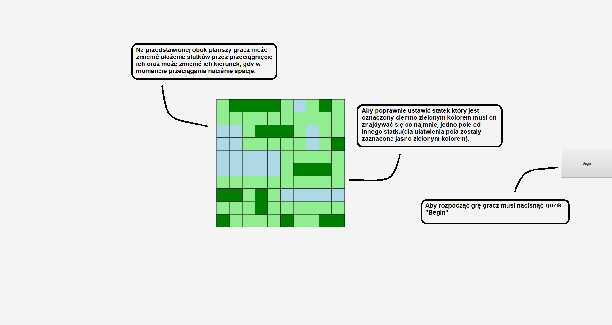
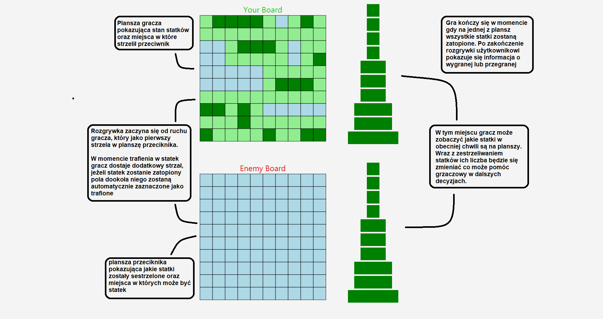
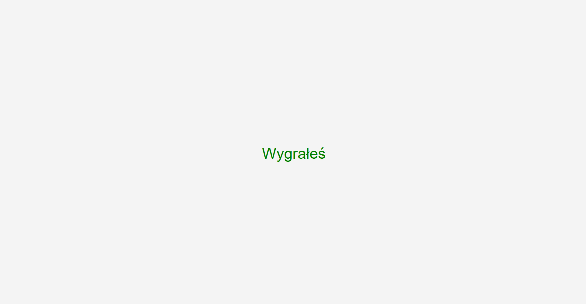
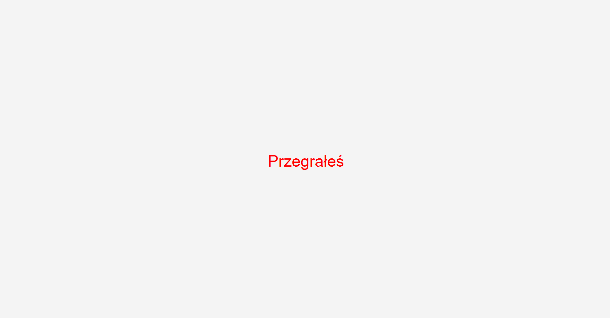

Gra w statki
====================
Projekt którego efektem końcowym jest aplikacja umożliwiająca zmierzenie się użytkownikowi 
z komputerem w kultową grę w statki
- - -

Opis funkcjonalny
================================
Instrukcja obsługi dla użytkownika

Okno wyświetlające plansze na której gracz przygotowuje się do rozgrywki

Okno wyświetlające przebieg gry

Okno wyświetlające się po wygranej rozgrywce

Okno wyświetlające się po przegranej rozgrywce

- - -

Wykorzystane narzędzia 
================================

IntelliJ IDEA - środowisko programistyczne w którym powstał projekt

Java - obiektowy język programowania za pomocą którego projekt został napisany

JavaFX - technologia która została wykorzystana aby program był reprezentowany w formie Rich Internet Application

---
Podział zadań
================================
Denis Kurek  | Igor Demczak
------------- | -------------
 Utworzenie repozytorium | Interface użytkownika
 Utworzenie klas z beckend | Instrukcja
 Logika gry | Dokumentacja

